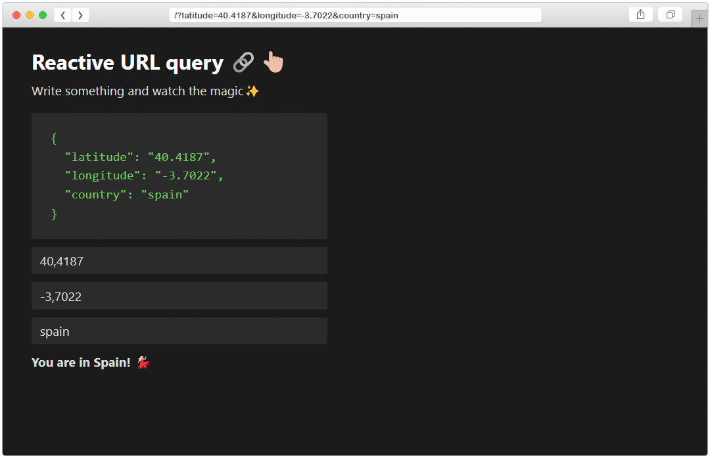

# Reactive URL query

> This is a project with an example of reactive URL query management

## Description

I have created this small example based on a personal project where I had to manage independent parameters in a URL reactively. I hope I have written it as simply and concisely as possible for clarity.

## Demo

[Click to see the demo](https://kevinsillo.github.io/vue-reactive-url/)

